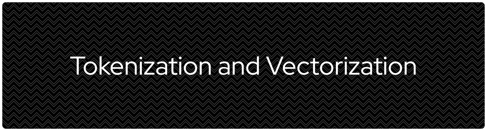
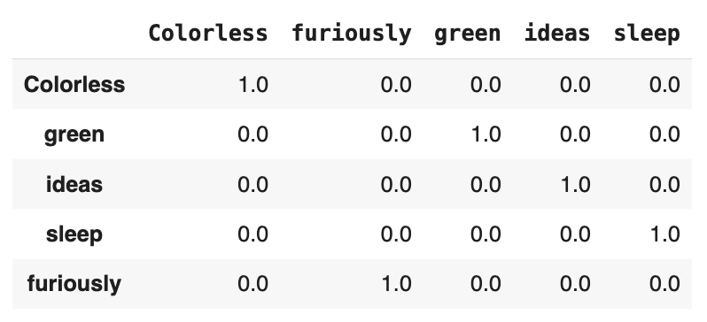
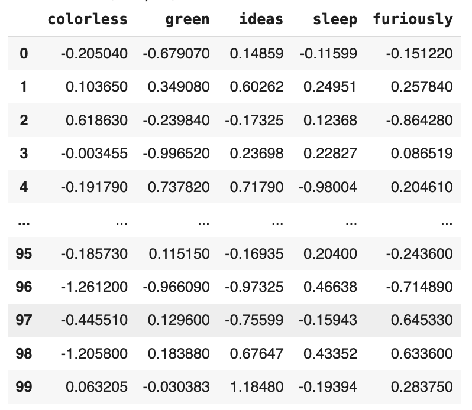

# **Language Tokenization Strategies and Embedding Vector Conversions**

## **Summary**
Language models, both traditional vs modern and small vs large, always split up a collection of texts into tokens (small, manageable chunks of texts) before they are converted to a list of numerical values, namely vector. This repository is intended to document my personal journey of learning different tokenization strategies from traditional text split by white space to byte level split. In addition to tokenization strategies, this repository also covers the extent to which I understand embedding vectors, starting from the sparsity problem with traditional vectorization techniques, particularly one-hot encoding, to contextual embeddings which already become the common practice in today's NLP applications in LLMs. 

## **1 One-Hot Encoding**
One-hot encoding is a common technique in traditional NLP by converting tokens into vectors so that machine learning algorithms can model the patterns (e.g., negative sentiment characterized by the presence of a specific set of tokens associated with less desirable qualities or negative perceptions). While this tokenization technique is useful, this technique introduces the sparsity problem. One-hot encoding basically converts a token into either 1 for present and 0 for absent in a document. This eiher 1 or 0 is where the sparsity happens. Sparsity occurs when a matrix which represents documents by rows and features (tokens) by columns contains a large number of zeros. When a matrix is largely populated by zeros, computation memory will be wasted to process the absence of a token. 

 
**Image 1**: A dataframe of one-hot encoded sentence. Let us assume this is a matrix of one-hot encoded sentence.

As shown, sentence, "Colorless green ideas sleep furiously.", is represented by the presence or absence of the word by 1 (present) and 0 (absent). This encoding can lead to vocabulary explosion in morphologically rich languages like Indonesian. Each variant will be treated as a separate column in matrix, increasing dimensionality and sparsity at the same time. This will be a worse problem when the dataset is a set of samples from social media where users use a wide variety of spellings. The dimensionality and sparsity can even be more problematic. Moreover, as this simple tokenization and vectorization (categorical to numerical values) on the absence or presence of a token, the encoding does not include semantic information too, making us telling token *ideas* and *concepts* are semantically similar become impossible. The limitation on semanticity of tokens does not enable meaning-related NLP tasks such as document clustering by meaning, semantic search, and keyphrase extraction theoretically less possible.

## **2 Static Dense Embeddings**
Static embeddings such as GloVe, Word2Vec, and fastText can resolve the semantic problems in one-hot encoding by instead of representing tokens with either 1 or 1, they use dense vectors, i.e., compact numerical representations which involves non-zero floating points, containing both semantic and syntactic information of the tokens. But it is worth to note that unlike one-hot encoding which directly makes sense to humans, dense embeddings do not since they encode meanings geometrically, not linguistically. 

 
**Image 2**: Each token is represented in a long vector containing numbers with floating points.

While static embeddings can solve the semantic problem in one-hot encoding (as well as frequency-based encoding such as term frequency and term frequency-inverse document frequency), static embeddings treat the same tokens the same regardless their syntactic positions. For example, the vector representing token *sleep* as verb as in sentence, "Colorless green ideas sleep furiously.", will be the same as to the same token as in "I sleep at night.". This happens because the values in static embeddings remains the same regardless the context, especially related to in what position the token *sleep* is used and what relation it bears with other tokens in the same sentence.

To check if the same words in different uses have the same embedding vectors, we can both compare the embedding vectors of both tokens side by side. Alternatively, it is also possible to use cosine similarity to examine the semantic similarity between the vectors. If the value is closer to 1, both vectors share similar semantic information.

**Step 1**: Calculate the dot product between vector A (from token *sleep* in sentence A, $A=[a_1, a_2, a_3, ... a_n]$) and B (from the same token in sentence B, $B=[b_1, b_2, b_3 ..., b_n]$). Dot product seeks to measure similarity between vectors in terms of directions (positive for same direction, negative for opposite direction). It works by multiplying each component (e.g., $a_i \times b_i$) and then summing them up.

$$
\begin{align}
A\cdot B &=\sum_i A_i \times B_i = 0.846890^2 + 0.588220^2 + (-0.617240)^2 + \: ... \: + (-0.115990)^2 = 1.7331
\end{align}
$$

**Step 2**: Compute the magnitude (norm, $||A||$ and $||B||$). Norm or magnitude denotes the length of a vector in $n$-dimensional space. It is called normalization because it uses the Euclidean normalization (L2 norm) formula where $\|A\|=\sqrt{a_1^2, a_2^2, a_3^2 + ... + a_n^2}$. 

$$
\begin{align}
\|A\| &=\sqrt{\sum_i A_i^2}=\sqrt{1.7331} = 1.3165\\
\|B\| &=\sqrt{\sum_i B_i^2} = \sqrt{1.7331}= 1.3165
\end{align}
$$

**Step 3**: Calculate cosine similarity. Cosine similarity is the angle between two vectors, computed by dividing the dot product (similarity in direction and magnitude) by the product of norms. The division is done to remove the effect of vector length so the directional similarity can be defined. In its output interpretation, 1.0 ($\theta=0 \degree$) means identical direction and therefore highly similar meaning while -1.0 ($\theta=180\degree$) means opposite meaning. Value 0.0 ($\theta=90\degree$) also possible, meaning completely unrelated.

$$
\text{Cosine Similarity}=\frac{A \cdot B}{\|A\|\cdot \|B\|} = \frac{1.7331}{1.3165 \times 1.3165} =\frac{1.7331}{1.7331}=1.00
$$

## **3 Contextual Dense Embeddings**
On the contrary to static embeddings, contextual embeddings such as BERT and RoBERTa will encode both semantic and syntactic information as well. The embedding vectors even for eactcly the same word with the same word class (e.g., *sleep* (verb) in sentence 1 vs *sleep* (verb) in sentence 2) will be different.